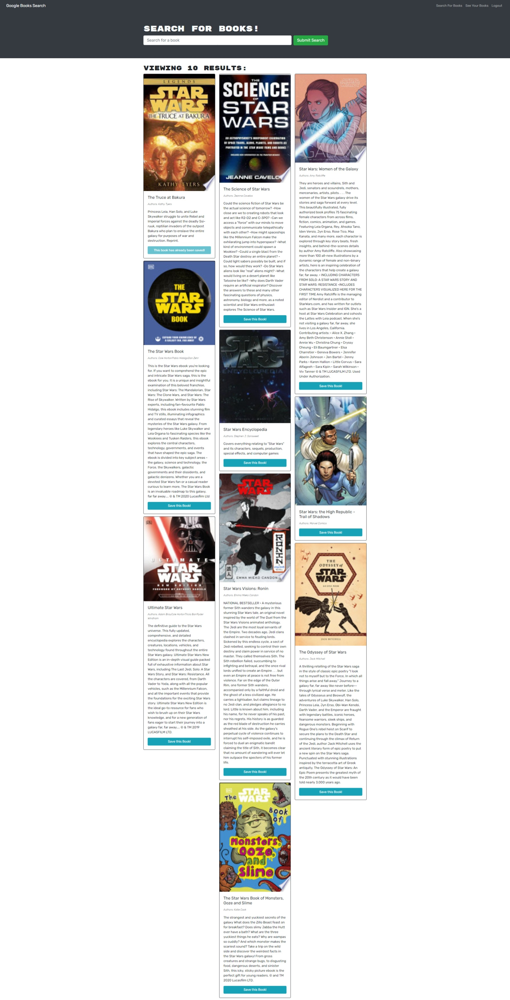

# book-search
A site whee you can save books you are planning to read or have already read.

## Table of Contents
- [book-search](#book-search)
  - [Table of Contents](#table-of-contents)
  - [Built With](#built-with)
  - [Website](#website)
  - [Contribution](#contribution)
  - [License](#license)
  - [Preview](#preview)
## Built With
* HTML
* CSS
* JavaScript
* MERN
* Bootstrap
  
## Website
[Book Search Site](https://rocky-harbor-87907.herokuapp.com/)

## Contribution

## License
[MIT](./LICENSE)

## Preview

